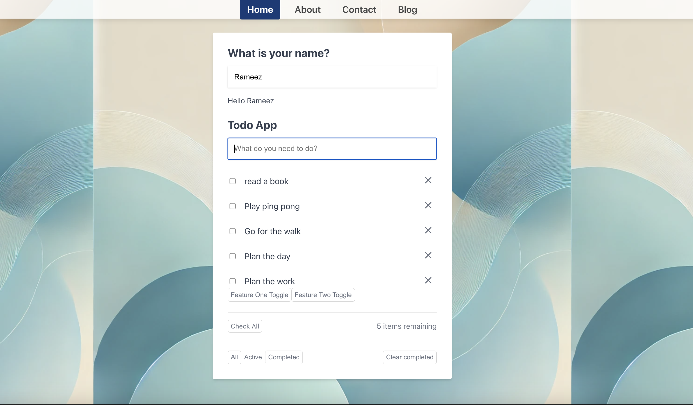

# React To Do App

This project was bootstrapped with [Create React App](https://github.com/facebook/create-react-app).

[Watch the demo video](public/screen.mp4)

<video width="600" autoplay loop muted playsinline>
  <source src="public/screen.mp4" type="video/mp4">
  Your browser does not support the video tag.
</video>

## Available Scripts

In the project directory, you can run:

### `yarn start`

Runs the app in the development mode.\
Open [http://localhost:3000](http://localhost:3000) to view it in your browser.

The page will reload when you make changes.\
You may also see any lint errors in the console.

### `yarn test`

Launches the test runner in the interactive watch mode.\
See the section about [running tests](https://facebook.github.io/create-react-app/docs/running-tests) for more information.

### `yarn build`

Builds the app for production to the `build` folder.\
It correctly bundles React in production mode and optimizes the build for the best performance.

The build is minified and the filenames include the hashes.\
Your app is ready to be deployed!
